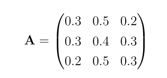

# Sampling a Markov chain

In this exercise we are going to learn how to write a function that generates the next random variable if we have a Markov chain.   We will consider a Markov chain with the following transition matrix in the exercise:



As you can see from the sample code in `main.py` we can create a variable called `A` in python and set it equal to this matrix by using the code below:

```python
A = np.array([[0.3,0.5,0.2],[0.3,0.4,0.3],[0.2,0.5,0.3]])
```

Your task in this exercise is to write a function called `markov_move` that takes two arguments.  The first of these arguments, `trans`, should be the 1-step transition matrix for the Markov chain that is being simulated.  The second argument is then the current state `start` is the state that the system is currently within.  Your function should generate the next state in the chain.

Notice that each row of the 1-step transition probablity matrix is a probablity mass function for a multinomial trial.  The function you write will thus be similar to the functions you have written in the past for generating multinomial random variables.  You will need to use the variable called `start` to decide which row of the matrix to use when generating the multinomial variable.
